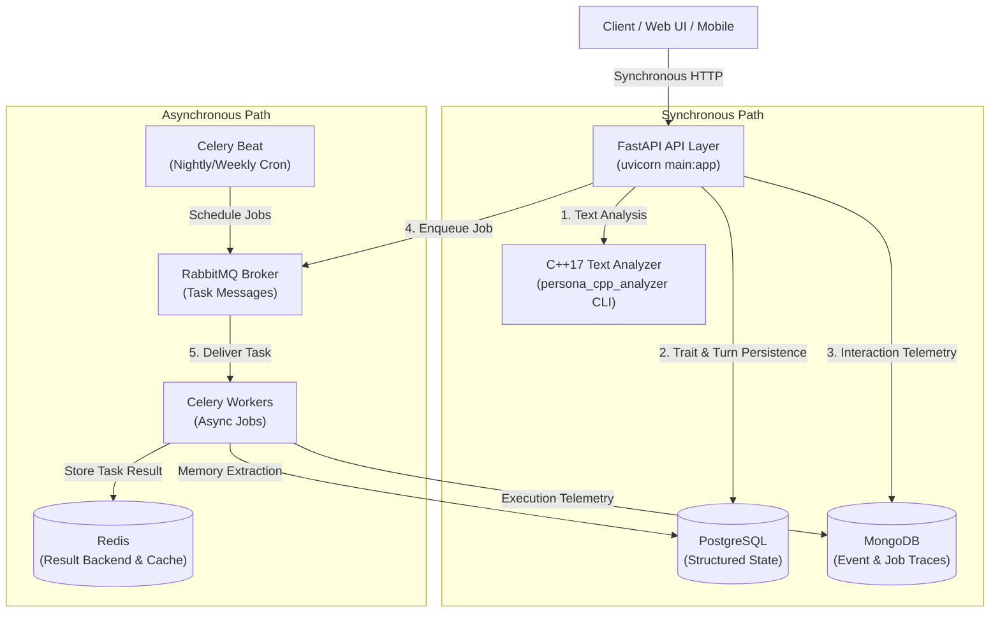

# PersonaAI — Production AI Backend

[](https://www.python.org/)
[](https://fastapi.tiangolo.com/)
[](https://www.postgresql.org/)
[](https://www.mongodb.com/)
[](https://www.rabbitmq.com/)
[](https://redis.io/)
[](https://docs.celeryq.dev/)
[](https://isocpp.org/)
[](https://www.docker.com/)
[](docs/AWS_DEPLOYMENT.md)

PersonaAI is a production-oriented AI backend that builds a dynamic, long-term memory and personalized emotional model of users during multi-turn interactions.

It combines a **FastAPI API layer**, **PostgreSQL** relational state management, **MongoDB** event/interaction trace logging, **RabbitMQ** task queue messaging, **Redis** short-lived caching and Celery result backend, **Celery** background workers, and a native **C++17 text analytics component** into a deployable, scalable microservice stack.

---

## 1. System Architecture



---

## 2. Component Responsibilities

| Component | Technology | Primary Responsibility |
|---|---|---|
| **API Layer** | FastAPI (Python 3.12+) | HTTP request validation, correlation ID middleware, API routing, `/ready` & `/health` probes |
| **Relational Database** | PostgreSQL 16 | ACID-compliant structured state: user profiles, emotional relationship states, candidate turns, memory records |
| **Document Store** | MongoDB 7.0 | Append-only event telemetry, AI interaction traces, async job execution logs, evaluation records |
| **Message Broker** | RabbitMQ 3.13 | Decoupled asynchronous task queueing, late acknowledgement semantics (`acks_late=True`), message persistence |
| **Cache & Task Results** | Redis 7.0 | Celery task result backend, short-lived session state, fast key-value caching |
| **Background Processing**| Celery 5.4 | Asynchronous job execution (memory consolidation, async memory extraction, evaluation tasks) with exponential retries |
| **Native Computational Engine**| C++17 | Subprocess CLI engine for high-performance lexical analysis, readability scoring, and 16-dim feature hashing |

---

## 3. Data Architecture: PostgreSQL vs MongoDB

PersonaAI separates data responsibilities based on data access patterns rather than using a single database for all workloads:

### PostgreSQL (Structured Relational State)
- **Use Case:** Core transactional and relational entities where schema enforcement and ACID consistency are required.
- **Tables:**
  - `users`: User entity tracking and creation timestamps.
  - `user_state`: User profile JSON, emotional tendencies, and relationship metrics (familiarity, trust, affection).
  - `memories`: Fact and episodic memory items with importance weights, access counts, and decay tracking.
  - `turns`: Sequential conversation message history.
  - `candidates`: Model response candidates (accepted vs. rejected) for DPO preference dataset generation.

### MongoDB (Unstructured Telemetry & Event Traces)
- **Use Case:** High-frequency append-only document logs, execution metadata, and flexible schema records where query filters target nested JSON subdocuments.
- **Collections:**
  - `interaction_events`: Full turn payloads, including C++ text stats, latency breakdown, and model debug info.
  - `async_job_logs`: Execution records of Celery tasks, including task duration, input parameters, result payload, and error tracebacks.
  - `evaluation_records`: SFT/DPO export metrics and model evaluation run outputs.

---

## 4. Infrastructure Architecture: RabbitMQ vs Redis

### RabbitMQ (Task & Message Broker)
- **Why RabbitMQ over Redis for Queues?**
  RabbitMQ acts strictly as the **Celery message broker**. It provides robust AMQP protocol guarantees, durable queues, consumer acknowledgements (`acks_late=True`), task prefetching, and worker heartbeat management. This ensures no background tasks (e.g. memory consolidation, batch evaluation) are lost if a worker process crashes mid-execution.

### Redis (Result Backend & Cache)
- **Why Redis for Results & Caching?**
  Redis acts as the **Celery result backend** (`REDIS_URL`) and short-lived application cache. It offers low-latency key-value lookups with TTL expiration (`result_expires=3600`) for async task status polling via `GET /tasks/{task_id}`.

---

## 5. Native C++17 Component (`persona_cpp_analyzer`)

### Why C++17?
High-frequency text analytics (e.g., tokenizing large incoming messages, calculating lexical diversity, syllable-based readability scoring, and vectorizing text via feature hashing) can be CPU-intensive when processed synchronously in Python. The C++17 module offloads computational workload into a compiled binary.

### Key Metrics Computed:
- **Lexical Statistics:** Character count, word count, sentence count, average word length, Type-Token Ratio (TTR).
- **Readability Scoring:** Flesch Reading Ease score derived from syllable counts and sentence length.
- **Emotion Keyword Frequency:** Fast scanning against positive, negative, anxiety, and urgency lexicons.
- **Feature Hashing (16-dim):** Fixed-size normalized feature projection vector using FNV-1a hashing.

### Integration Mechanism & Fallback:
Python invokes the C++ binary via a clean subprocess CLI boundary (`app/cpp_wrapper.py`). 
If the binary is missing or fails, `analyze_text_cpp` **gracefully falls back to a pure-Python analyzer**, ensuring zero downtime or hard crashes in restricted environments.

---

## 6. Asynchronous Task Processing & Failure Handling

 Celery tasks are defined in `app/tasks.py`:

- `extract_memory_async`: Performs async C++ text feature extraction and inserts memories into PostgreSQL and MongoDB.
- `consolidate_memory`: Consolidates user memory history into shared relationship summaries.
- `evaluate_response_async`: Asynchronously evaluates model response candidates against character fidelity metrics.
- `export_training_data`: Batch SFT/DPO dataset generation job.

### Failure Handling & Retries:
- **Exponential Backoff:** Tasks use `autoretry_for=(Exception,)`, `retry_backoff=True`, and `max_retries=3`.
- **Late Acknowledgements:** Tasks set `task_acks_late=True` and `task_reject_on_worker_lost=True` so messages are re-queued if a Celery worker dies unexpectedly.
- **Audit Logging:** Every task execution (SUCCESS/FAILURE, duration_s, exception details) is written to MongoDB `async_job_logs`.

---

## 7. Local Setup & Docker Instructions

### Prerequisites
- Docker & Docker Compose
- (Optional for standalone dev) Python 3.12+, GCC/g++ (with C++17 support)

### Option A: Running the Full Stack with Docker Compose (Recommended)

Start all 7 services (FastAPI, Celery worker, Celery beat, PostgreSQL, MongoDB, Redis, RabbitMQ):

```bash
docker compose up --build
```

#### Verification:
- **FastAPI API:** http://localhost:8000
- **Interactive OpenAPI Docs:** http://localhost:8000/docs
- **RabbitMQ Management Dashboard:** http://localhost:15672 (User: `guest` / Pass: `guest`)
- **Health Check:** `curl http://localhost:8000/health`
- **Readiness Check:** `curl http://localhost:8000/ready`

### Option B: Local Development without Docker

```bash
# 1. Install dependencies
pip install -r requirements.txt

# 2. Compile C++ component (Win/Linux)
g++ -std=c++17 -Icpp/include cpp/src/analyzer.cpp cpp/src/main.cpp -o cpp/persona_cpp_analyzer

# 3. Run Pytest suite
python -m pytest

# 4. Start FastAPI server
uvicorn main:app --reload --port 8000
```

---

## 8. API Examples

### 1. Synchronous Chat (`POST /chat`)
```bash
curl -X POST http://localhost:8000/chat \
  -H "Content-Type: application/json" \
  -d '{
    "user_id": "u123",
    "session_id": "s456",
    "message": "I am feeling really happy and excited about my new project today!",
    "show_debug": true
  }'
```

### 2. Submit Async Memory Task (`POST /tasks/memory-extraction`)
```bash
curl -X POST http://localhost:8000/tasks/memory-extraction \
  -H "Content-Type: application/json" \
  -d '{
    "user_id": "u123",
    "message": "I love building scalable backend architectures in Python and C++."
  }'
```

### 3. Check Task Status (`GET /tasks/{task_id}`)
```bash
curl http://localhost:8000/tasks/<task_id_here>
```

### 4. Readiness Probe (`GET /ready`)
```bash
curl http://localhost:8000/ready
```
Returns service health status for PostgreSQL, MongoDB, Redis, RabbitMQ, and C++ component.

---

## 9. AWS Deployment Readiness

PersonaAI is architected for deployment to AWS infrastructure:
- **Compute:** AWS ECS Fargate tasks running behind an Application Load Balancer (ALB).
- **Relational DB:** Amazon RDS for PostgreSQL.
- **Document DB:** Amazon DocumentDB (MongoDB-compatible).
- **Message Broker:** Amazon MQ for RabbitMQ.
- **Cache/Results:** Amazon ElastiCache for Redis.

Detailed step-by-step deployment instructions, IAM security policies, and environment variable mappings are documented in [`docs/AWS_DEPLOYMENT.md`](docs/AWS_DEPLOYMENT.md).

---

## 10. Testing Strategy

The repository includes a comprehensive 27-test suite covering unit, integration, and E2E scenarios:

```bash
python -m pytest -v
```

### Test Coverage:
- `tests/test_pipeline.py`: Persona orchestrator, state persistence, memory retrieval, scene state.
- `tests/test_ml_and_export.py`: Scikit-learn EQ model training, save/load, dataset export.
- `tests/test_cpp_analyzer.py`: C++ text analyzer execution, metric calculation, Python fallback.
- `tests/test_mongo.py`: MongoDB repository insertion, querying, and offline fallback behavior.
- `tests/test_tasks.py`: Celery background task execution in eager test mode.
- `tests/test_health_ready.py`: FastAPI `/health` and `/ready` endpoint verification.
- `tests/test_api_v2.py`: FastAPI `/chat` and `/tasks/*` async workflow routes.

---

## 11. Summary of Genuinely Implemented Technologies

The following technologies are actively integrated, runnable, and testable in this repository:

1. **Python 3.12+ & FastAPI:** Async web engine with Pydantic validation, custom middleware, and OpenAPI documentation.
2. **PostgreSQL:** SQLAlchemy Core relational persistence for user profiles, turn histories, and memory items.
3. **MongoDB:** PyMongo document store for interaction telemetry events, Celery job logs, and evaluation records.
4. **RabbitMQ:** Task queue message broker for Celery asynchronous processing.
5. **Redis:** Fast key-value cache and Celery task result backend.
6. **Celery:** Asynchronous job execution framework with exponential backoff retries and crontab scheduled beat tasks.
7. **C++17:** Native C++ text analytics engine compiled with CMake/g++, integrated via Python subprocess interface with pure-Python fallback.
8. **Docker & Docker Compose:** Multi-container stack featuring health checks, persistent volume mounts, and non-root runtime security.
9. **AWS Readiness:** Prepared infrastructure configurations and step-by-step guide for Amazon ECS, RDS, DocumentDB, ElastiCache, and Amazon MQ.
