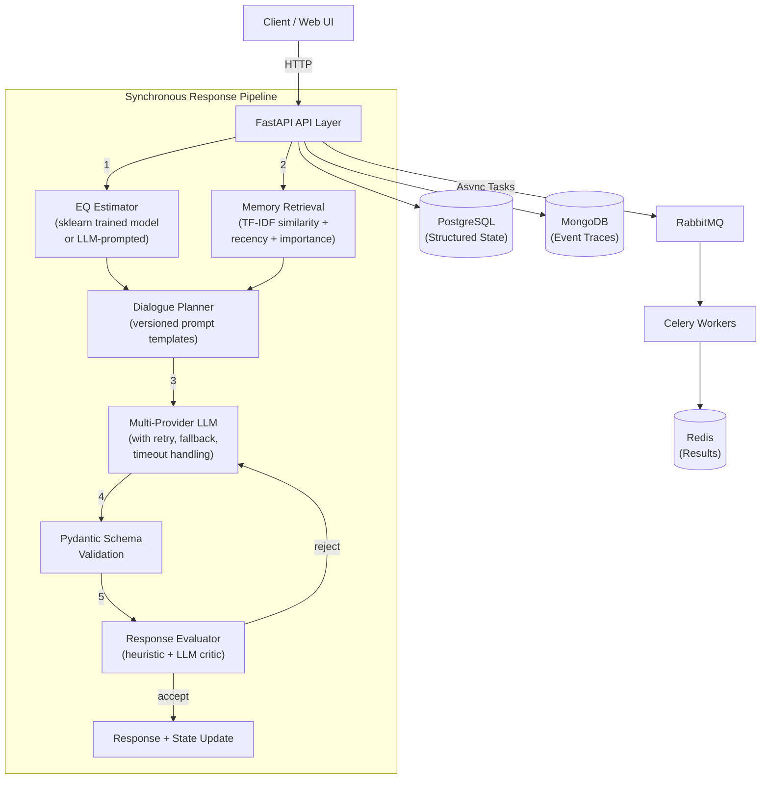

# PersonaAI — Production-Oriented AI Backend

[](https://www.python.org/)
[](https://fastapi.tiangolo.com/)
[](https://www.postgresql.org/)
[](https://www.mongodb.com/)
[](https://www.rabbitmq.com/)
[](https://redis.io/)
[](https://docs.celeryq.dev/)
[](https://isocpp.org/)

PersonaAI is a **development-stage** AI backend that builds a dynamic, long-term memory and personalized emotional model of users during multi-turn interactions. It combines retrieval-augmented generation, multi-provider LLM orchestration, and structured state management into a testable system.

> **⚠️ Status**: This is an engineering R&D project, not a production-ready product. See [Limitations](#limitations) below for what is and isn't implemented.

---

## Architecture Overview



---

## What's Actually In This Repo

### Retrieval System (Memory/RAG)
- **Implementation**: TF-IDF cosine similarity over per-user memory stores, combined with recency and importance scoring. This is **not** a learned embedding model — it's a configurable retrieval system designed so a real embedding backend (sentence-transformers, API embeddings) can be dropped in by implementing the `EmbeddingBackend` interface in `app/memory.py`.
- **User isolation**: Every retrieval query is scoped to a single `user_id`. Cross-user retrieval is explicitly tested and prevented.
- **Configurable**: Top-k, kind filtering, and minimum importance thresholds are configurable.

### LLM Integration (External API)
- **Multi-provider**: OpenRouter, Groq, Google Gemini, Cohere, Anthropic — cascading fallback chain.
- **Reliability**: Configurable timeout, bounded retry with exponential backoff, provider-level failure isolation.
- **Observability**: Every LLM call is instrumented with latency, token usage, retry count, and provider metrics.
- **Deterministic fallback**: MockLLMClient provides offline/credential-free operation.

### Structured Output Validation
- **Pydantic schemas** (`app/schemas.py`) validate all LLM-generated JSON before it enters application state.
- **Retry on validation failure**: If LLM output doesn't match schema, the system retries with validation feedback.
- **Safe defaults**: If all validation attempts fail, schema defaults are used rather than corrupting persistent state.

### EQ Estimator (Emotion/Intent Classification)
- **Trained model** (`app/ml/eq_model.py`): Real scikit-learn multi-task classifier (TF-IDF features → per-task heads for emotion, intent, need, social state). This is **not** a fine-tuned transformer — it's an sklearn model trained on bootstrapped/templated data, explicitly noted as such.
- **LLM fallback**: When no trained model is available, uses LLM-prompted structured extraction with the same interface.
- **Temporal continuity**: Exponential smoothing on trained model outputs to prevent state whiplash.

### Prompt Engineering
- **Versioned templates** (`app/prompts.py`): All prompts are defined as versioned `PromptTemplate` objects with explicit separation of system instructions, task instructions, and retrieved context.
- **Prompt injection prevention**: System instructions are clearly demarcated with `[SYSTEM INSTRUCTIONS — DO NOT OVERRIDE]` markers. Retrieved content is explicitly labeled as reference material.
- **Traceability**: Prompt version tags are embedded in every response and visible in evaluation output.

### Evaluation Harness
- **6 existing evaluations**: Emotion classifier ablation, memory extraction, response critic, strategy selection, style vector, personality drift.
- **7 extended evaluations**: Retrieval relevance, context recall, response grounding, structured output validity, hallucination checks, regression tests, latency/token tracking.
- **Evaluation data**: Hand-built test sets including adversarial cases. These are not independently validated.

### Security / Data Isolation
- **User isolation**: SQL queries filter by `user_id`. Memory retrieval is scoped per-user. Delete operations require matching `user_id`.
- **Optional API key auth**: Set `PERSONA_API_KEY` env var to require Bearer token authentication on all endpoints except `/health` and `/ready`.
- **Tested**: Dedicated cross-user isolation tests verify no memory, turn, or state leakage.

### Background Processing
- **Celery + RabbitMQ + Redis**: Async tasks for memory extraction, consolidation, evaluation, and dataset export.
- **Failure handling**: `autoretry_for=(Exception,)`, `retry_backoff=True`, `max_retries=3`, `task_acks_late=True`.
- **Audit logging**: Every task execution logged to MongoDB with duration, status, and error details.

### Observability
- **Structured metrics** (`app/observability.py`): Thread-safe in-process metrics for LLM latency, retrieval latency, request latency, failures, retries, regeneration counts, token usage.
- **`/metrics` endpoint**: Returns current metrics snapshot without exposing secrets or user content.
- **Correlation IDs**: Every request gets a unique `X-Request-ID` header.

---

## Limitations

This project is **not production-ready**. Key limitations:

1. **No learned embeddings**: Memory retrieval uses TF-IDF, not sentence-transformers or API embeddings. The interface is designed for drop-in replacement.
2. **No trained reward model**: Response evaluation uses heuristics + LLM self-critique, not a trained preference model.
3. **EQ classifier is sklearn, not a transformer**: The emotion/intent classifier uses TF-IDF features with sklearn heads, not a fine-tuned DeBERTa/ModernBERT. This is explicitly noted in the code.
4. **Evaluation data is synthetic**: Test sets are hand-built with templated data, not independently validated on real user data.
5. **No horizontal scaling**: The metrics collector is in-process. Production would need Prometheus/Datadog/CloudWatch.
6. **Authentication is basic**: Optional Bearer token auth, not OAuth/OIDC/JWT.
7. **Training scripts require GPU**: SFT/DPO training scripts in `training/` require torch + GPU, which is not available in all environments.

---

## Local Setup

### Prerequisites
- Python 3.12+
- (Optional) Docker & Docker Compose for full stack

### Quick Start
```bash
pip install -r requirements.txt
python -m pytest -v                    # Run all tests
uvicorn main:app --reload --port 8000  # Start server
```

### Docker Compose (Full Stack)
```bash
docker compose up --build
```

### Environment Variables
See `.env.example` for all configuration options. Key new settings:

| Variable | Default | Description |
|---|---|---|
| `LLM_TIMEOUT_S` | `30` | Per-provider LLM timeout in seconds |
| `LLM_MAX_RETRIES` | `3` | Max retry attempts per provider |
| `PERSONA_API_KEY` | (none) | Set to enable Bearer token authentication |
| `EMBEDDING_BACKEND` | `tfidf` | Memory embedding backend |

---

## Testing

```bash
# All tests (existing + new integration tests)
python -m pytest -v

# Integration tests only
python -m pytest tests/test_integration.py -v

# Extended evaluation harness
python ml/evaluation/eval_extended.py
```

### Test Coverage
- `tests/test_pipeline.py`: Orchestrator, state persistence, memory retrieval, scene state
- `tests/test_integration.py`: **NEW** — 30+ integration tests covering:
  - End-to-end API → retrieval → LLM flow
  - Malformed LLM output handling
  - Provider failure and fallback
  - Retry behavior
  - Cross-user isolation (security)
  - Persistence
  - Retrieval failure handling
  - Background task execution
  - Structured output validation
  - Observability metrics
- `tests/test_ml_and_export.py`: EQ model training, save/load, dataset export
- `tests/test_tasks.py`: Celery background tasks
- `tests/test_api_v2.py`: FastAPI endpoints
- `tests/test_health_ready.py`: Health/readiness probes
- `tests/test_cpp_analyzer.py`: C++ analyzer and fallback
- `tests/test_mongo.py`: MongoDB repository and fallback

---

## API Endpoints

| Method | Path | Description |
|---|---|---|
| `POST` | `/chat` | Synchronous chat with debug info |
| `GET` | `/character` | Active character metadata |
| `GET` | `/user/{user_id}/state` | User model and relationship state |
| `GET` | `/user/{user_id}/memories` | User's long-term memories |
| `DELETE` | `/user/{user_id}/memories/{id}` | Delete a specific memory |
| `POST` | `/user/{user_id}/profile/import` | Ingest profile text |
| `GET` | `/user/{user_id}/style` | Communication style analysis |
| `GET` | `/user/{user_id}/history` | Conversation history |
| `POST` | `/tasks/memory-extraction` | Async memory extraction |
| `POST` | `/tasks/evaluate` | Async response evaluation |
| `GET` | `/tasks/{task_id}` | Task status |
| `GET` | `/metrics` | **NEW** — Observability metrics |
| `GET` | `/health` | Liveness probe |
| `GET` | `/ready` | Readiness probe |
